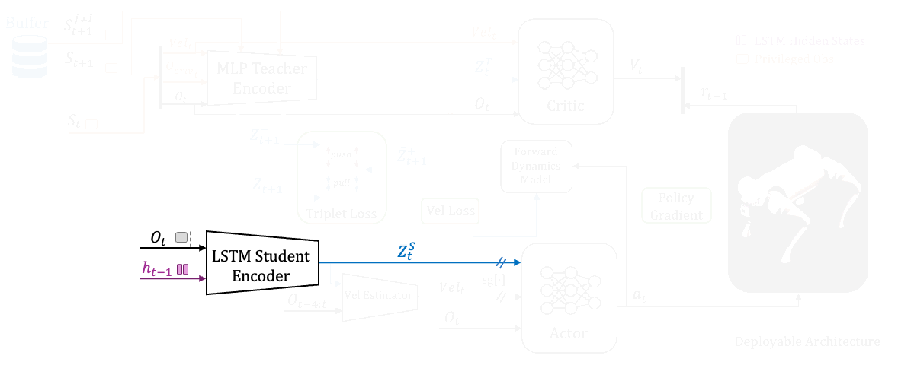

# 🐾 TARLoco: Teacher-Aligned Representations via Contrastivde learning for Quadrupedal Locomotion  

[](https://arxiv.org/abs/2503.20839)
[](https://wandb.ai/amrmousa-m/TAR_workspace)
[](https://docs.python.org/3/whatsnew/3.11.html)
[](https://releases.ubuntu.com/22.04/)
[](https://github.com/isaac-sim/IsaacLab)
[](https://creativecommons.org/licenses/by-nc-sa/4.0/)

<p align="center">
  <video src="docs/intro.mp4" alt="TARLoco Demo" width="100%" muted autoplay loop></video>
</p>
  <br>
  <em>Official implementation of our IROS 2025 paper | <a href="https://amrmousa.com/TARLoco/">🌐 Project Website</a> with videos and results</em>
</p>

**TARLoco** is a modular and scalable framework for **blind quadrupedal locomotion** that integrates:

- **Teacher–Student training** with **representation learning via contrastive loss**.
- High‑fidelity simulation using **Isaac Sim** and streamlined workflows via **Isaac Lab**.
- **Sim‑to‑Real** deployment on **Unitree Go2** (SDK2 + LCM).

## 🔥 News

- **[18-08-2025]**: The [project website](https://amrmousa.com/TARLoco/) with paper, videos, and results is **live**.
- **[15-06-2025]**: This work is **accepted** at **IROS 2025**. 
- **[---Soon---]**: Sim2Real module (scripts + pretrained checkpoints) will be added here shortly. Stay tuned!


## ❓ Why TARLoco?



Robust blind locomotion must adapt to **unknown dynamics** (e.g., mass, friction, terrain). TARLoco aligns a student’s proprioceptive representation with a teacher’s **privileged latent** using **contrastive learning**, yielding policies that are:

- **Generalizable** across non‑stationary settings.
- **Compact & deployable** on real hardware.
- **Interpretable** via t‑SNE / UMAP visualizations of embeddings.


## 🛠 Installation

**Tested on**: Ubuntu 22.04 • CUDA 12.1 • Python 3.10  

```bash
# 1) Conda env
conda create -n tar python=3.10 -y
conda activate tar

# 2) Clone the repo
git clone https://github.com/ammousa/TARLoco.git
cd TARLoco

# 3) PyTorch (CUDA 12.1)
pip install --upgrade pip
pip install torch==2.5.1 --index-url https://download.pytorch.org/whl/cu121

# 4) Isaac Sim SDK
pip install isaacsim[all,extscache]==4.5.0 --extra-index-url https://pypi.nvidia.com

# 5) Isaac Lab
git clone --branch v2.1.0 https://github.com/isaac-sim/IsaacLab.git _isaaclab
sudo apt install -y cmake build-essential
./_isaaclab/isaaclab.sh --install

# 6) Smoke test (headless sim)
python _isaaclab/scripts/tutorials/00_sim/create_empty.py --headless

# 7) Dev install
pip install -e .
```

> **Tip:** If you use W&B logging, run `wandb login` once before training.


## 🚀 Usage

### Framework Tasks

We offer a comprehensive suite of tasks for training and evaluation, spanning various architectures and baselines:

| **Category**               | **Training Task**                          | **Evaluation Task**                      |
|----------------------------|--------------------------------------------|------------------------------------------|
| **TAR (MLP Architectures)** | `go1-train-tar-mlp-rough`                 | `go1-eval-tar-mlp-rough`                 |
|                            | `go1-train-tar-mlp-no-priv-rough`         | `go1-eval-tar-mlp-no-priv-rough`         |
|                            | `go1-train-tar-mlp-no-priv-no-vel-rough`  | `go1-eval-tar-mlp-no-priv-no-vel-rough`  |
| **TAR (RNN Architectures)** | `go1-train-tar-rnn-rough`                 | `go1-eval-tar-rnn-rough`                 |
|                            | `go1-train-tar-rnn-no-priv-rough`         | `go1-eval-tar-rnn-no-priv-rough`         |
|                            | `go1-train-tar-rnn-no-priv-no-vel-rough`  | `go1-eval-tar-rnn-no-priv-no-vel-rough`  |
| **TAR (TCN Architectures)** | `go1-train-tar-tcn-rough`                 | `go1-eval-tar-tcn-rough`                 |
| **SLR**                    | `go1-train-slr-rough`                     | `go1-eval-slr-rough`                     |
| **HIMLoco**                | `go1-train-him-rough`                     | `go1-eval-him-rough`                     |
| **Expert Teacher Policies** | `go1-train-teacher-rough`                 | `go1-eval-teacher-rough`                 |
|                            | `go1-train-teacher-encoder-rough`         | `go1-eval-teacher-encoder-rough`         |
|                            | `go1-train-teacher-rnn-rough`             | `go1-eval-teacher-rnn-rough`             |

Below are examples of how to train and evaluate TARLoco models. You can replace the `--task` argument with any task from the table above to experiment with different configurations.

### Training Example
Train a TAR student (RNN) on rough terrain:
```bash
python standalone/tarloco/train.py \
  --task go1-train-tar-rnn-rough \
  --headless --device cuda
```

### Evaluation Example
Evaluate a checkpoint for the same task but with additional evaluation conditions:
```bash
python standalone/tarloco/evaluate.py \
  --task go1-eval-tar-rnn-rough \
  --headless --device cuda \
  --load_run 2025-07-25_00-54-10_SLR_S96_29 \
  --checkpoint model_10000
```


### Results

We host full results on [📊 W&B Dashboard](https://wandb.ai/amrmousa-m/TAR_workspace). Please check our [🌐 project website](https://amrmousa.com/TARLoco) for more details and testing videos.


## 🌟 Acknowledgments  

Special thanks to **[Bruno Adorno](https://bvadorno.github.io/)** and **Amy Johnson** from the **University of Manchester** for providing the hardware for testing and for their unwavering support throughout the project.

This work builds upon:  
- [**IsaacLab**](https://github.com/isaac-sim/IsaacLab) - Simulation backbone  
- [**RSL-RL**](https://github.com/leggedrobotics/rsl_rl) - RL foundation  
- [**SLR**](https://github.com/11chens/SLR-master) & [**HIMLoco**](https://github.com/OpenRobotLab/HIMLoco) - Baseline comparisons  

These components retain their original licenses -see `licenses/`-. Only new contributions in this repository are licensed under **CC BY-NC-SA 4.0**.


## 🔗 Citation

If you use TARLoco in your research, please cite:

```bibtex
@misc{mousa2025tarteacheralignedrepresentationscontrastive,
      title={TAR: Teacher-Aligned Representations via Contrastive Learning for Quadrupedal Locomotion}, 
      author={Amr Mousa and Neil Karavis and Michele Caprio and Wei Pan and Richard Allmendinger},
      year={2025},
      eprint={2503.20839},
      archivePrefix={arXiv},
      primaryClass={cs.RO},
      url={https://arxiv.org/abs/2503.20839}, 
}
```


## ⭐ Contributing

We welcome issues and PRs! If this project helps your research, please ⭐ the repo and share feedback.


---
<p align="center">
  <b>Unlock the Future of Blind Locomotion</b><br>
  <a href="https://github.com/ammousa/TARLoco">⭐ Star the Repository</a> • 
  <a href="https://arxiv.org/abs/2503.20839">📄 Read the Paper</a> • 
  <a href="">🎬 Watch the Demo</a>
</p>